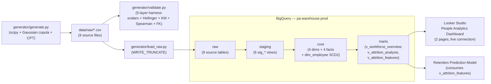

# pa-warehouse

> **⚠ SYNTHETIC DATA — Illustrative Only**
>
> This repository and its associated dashboard contain **no real company data**, **no real employees**, **no real compensation figures**. All values are generated by `generator/generate.py` for portfolio demonstration. Any resemblance to real organizations or persons is coincidental and unintended.

**Status:** `v0.2 — Loop 2 complete (full warehouse + 2-page interactive dashboard)`

A production-grade people analytics data warehouse on **BigQuery + dbt + Looker Studio**, with a Snowflake validation port. Built to demonstrate end-to-end PA data engineering: synthetic generation → cloud warehouse → SCD2 modeling → differentiating dashboard views → ML feature surface for retention prediction.

---

## What this is

A 6-loop iterative build of a portfolio-grade PA warehouse. Each loop ends with a shippable public artifact:

| Loop | Deliverable |
|---|---|
| 1 — Walking Skeleton ✓ | Tracer bullet: GCP + dbt + 50 fake employees + 1 chart in Looker Studio |
| 2 — Full source data + core ✓ | 2,500-employee generator + 5 fact tables + Type 2 SCD via `dbt snapshot` + 2 dashboard pages |
| 3 — Marts + differentiating metrics *(deferred — Wave 2)* | Extends dashboard to 4 pages with compa-ratio heatmap + progressive OLS panel + workforce-movement view |
| 4 — Polish + publish **(in progress)** | Schema cleanup, README polish, dbt-docs site, ML feature view for the retention model, LinkedIn |
| 5 — Snowflake port | `dbt build --target snowflake` parity demo |
| 6 — Retention prediction integration | Retention model reads `marts.v_attrition_features`, predictions back into the dashboard |

Full plan: [`BACKLOG.md`](./BACKLOG.md).

---

## Stack

- **Warehouse:** BigQuery (billing-enabled free tier; permanent live artifact)
- **Transformation:** dbt-core (`dbt-bigquery` primary, `dbt-snowflake` secondary)
- **BI:** Looker Studio (live BigQuery connector, public read-only)
- **Generator:** Python 3.11 — `scipy.stats.lognorm` + `faker` + Gaussian copula + CPT (per research synthesis 2026-05-15)

---

## Architecture



- **`raw`** — source tables loaded by `load_raw.py` from the generator's CSV output. Contract: 9 tables, never modified by dbt.
- **`staging`** — typed + renamed + lightly cleaned views over `raw`. One `stg_*` view per source. Tested with `not_null` / `unique` / `accepted_values` / `relationships`.
- **`core`** — dimensional models: `dim_date` (dynamic observation window), `dim_department` / `dim_job` / `dim_location` (Type 1), `dim_employee` (Type 2 SCD via `dbt snapshot` with COALESCE NULL-safety), and 4 fact tables.
- **`marts`** — dashboard-facing + ML-facing views. `v_workforce_overview` and `v_attrition_analysis` feed Looker Studio; `v_attrition_features` feeds the retention prediction model with an enforced dbt contract.
- **`dbt_project_evaluator`** *(meta dataset)* — output of the [dbt-project-evaluator](https://github.com/dbt-labs/dbt-project-evaluator) package. Routed here via `+schema:` so it doesn't pollute `raw`.

---

## Dashboard

### **[Live dashboard ↗](https://datastudio.google.com/reporting/c38e267f-ec30-478b-9d08-4878f2dad4b3)**

Two-page interactive People Analytics dashboard built on `marts.v_workforce_overview` and `marts.v_attrition_analysis` via the live BigQuery connector. No data extract — every chart fires a query at render time.

**Page 1 — Workforce Overview**
KPI strip (headcount, hires, exits, attrition rate) + headcount trend line + hires-vs-exits combo chart + department breakdown table with attrition heatmap and cross-filter drill-down.
[Screenshot](./screenshots/page1-workforce-overview.png)

**Page 2 — Attrition Analysis**
KPI strip (avg tenure at exit, regrettable share, voluntary attrition, involuntary attrition) + monthly attrition decomposition stack + tenure-at-exit distribution histogram + performance × attrition scatter plot.
[Screenshot](./screenshots/page2-attrition-analysis.png)

> **Legacy Loop 1 dashboard** (walking skeleton, 50 employees, 1 chart): [archived link](https://datastudio.google.com/reporting/8f7bc898-07ac-47cb-a9c6-73ead97311aa)

---

## How to reproduce

Prerequisites: Python 3.11, BigQuery project with billing enabled, service-account JSON pointed to by `GOOGLE_APPLICATION_CREDENTIALS`, and a configured `~/.dbt/profiles.yml` entry named `pa_warehouse` targeting your BigQuery project.

```bash
# 1. Install dependencies
pip install -r requirements.txt

# 2. Generate the synthetic dataset (2,500 employees × 36 months)
python generator/generate.py --n_employees 2500 --n_months 36 --seed 42

# 3. Validate the synthetic data (5-layer harness — scalars + Hellinger + KM + Spearman + FK)
python generator/validate.py

# 4. Load all 9 CSVs into BigQuery raw layer (WRITE_TRUNCATE)
python generator/load_raw.py

# 5. Build the full dbt pipeline (staging → core → marts + snapshots + tests)
cd dbt
dbt deps
dbt build

# 6. Build the ML feature view for the retention prediction model
# (default snapshot = 12 months ago)
dbt run --select v_attrition_features

# 6a. (Optional) build feature view for a specific historical snapshot:
dbt run --select v_attrition_features --vars '{"snapshot_date": "2025-01-01"}'

# 7. (Optional) audit code quality via dbt-project-evaluator
dbt build --select package:dbt_project_evaluator
```

**The Looker Studio dashboard** queries BigQuery live — no rebuild required. Once `dbt build` completes, the dashboard reflects the new data on next page load.

---

## Data Contract — pa-warehouse → Retention Prediction Model

`marts.v_attrition_features` is the **ML training input** consumed by the downstream Retention Prediction model (separate repo, in progress). The schema is enforced via a dbt model contract — schema drift breaks the dbt build, not the ML training notebook.

**Location:** `pa-warehouse-prod.marts.v_attrition_features` (BigQuery view, live).

**Grain:** one row per active employee at `snapshot_date`. Inactive employees (already exited OR not yet hired) are excluded.

**Schema:**

| Column | Type | Description |
|---|---|---|
| `employee_id` | STRING | Stable employee key. PK of the snapshot row. NOT NULL. UNIQUE within a snapshot. |
| `snapshot_date` | DATE | The date features were measured. Same for every row in one build. NOT NULL. |
| `tenure_months` | INT64 | Months between `hire_date` and `snapshot_date`. |
| `performance_tier` | STRING | Performance tier as of `snapshot_date` (ordinal 1-5 cast to string). |
| `compa_ratio` | FLOAT64 | Salary / band midpoint. Centered at 1.00. Below = underpaid vs band. |
| `is_critical_role` | BOOL | Whether the employee's job is flagged as critical (from `dim_job`). |
| `successor_count` | INT64 | Number of ready successors for this role. Higher = more replaceable. Defaults to 0 if no succession plan row exists. |
| `voluntary_exit_label` | BOOL | **Training target.** TRUE if the employee voluntarily exited within 12 months after `snapshot_date`. FALSE if still active OR exited involuntarily OR exited after the 12-month window. |

**Parameterization:** `snapshot_date` defaults to 12 months before `current_date()`, guaranteeing the label window has fully elapsed. Override via dbt var to train on multiple historical snapshots and avoid label leakage:

```bash
dbt run --select v_attrition_features --vars '{"snapshot_date": "2025-01-01"}'
```

**Refresh cadence:** Rebuilt on every `dbt build`. No automated scheduler today — Loop 4 polish targets a Makefile-orchestrated pipeline; future automation TBD.

**Class balance:** Positive class (voluntary exit within 12 months) typically lands in the 12-25% range depending on snapshot date. Observed 19.19% at `snapshot_date=2025-05-20` (consistent with the dashboard's 2025 voluntary attrition rate of 20.12%). The 36-month-average annual attrition rate is 14.1% per the generator's calibration; short windows in high-attrition years run above that.

**Sample query (training data extraction):**

```sql
SELECT *
FROM `pa-warehouse-prod.marts.v_attrition_features`
WHERE snapshot_date = '2025-05-20'
-- features land in employee_id-ordered rows ready for sklearn / xgboost / etc.
```

**Label leakage prevention:** Features are computed AS OF `snapshot_date`. The label looks ONLY at exits in `(snapshot_date, snapshot_date + 12 months]`. Pre-snapshot exits are not in the active cohort; post-window exits are censored to FALSE.

---

## Research foundation

The architectural and methodological choices in this project are grounded in three structured research syntheses (98 sources total, ~40 Tier-1 / peer-reviewed or vendor-canonical):

- **People analytics warehouse standards** (May 2026, 40 sources) — established the dimensional schema, attrition benchmarks, and the IsRegrettableFlag definition that anchors Page 2 of the dashboard
- **dbt + BigQuery + Looker Studio portfolio implementation** (May 2026, 38 sources, 19 Tier-1) — informed the live-connection mode choice (no extract cap), the schema routing strategy, and the SCD2 snapshot approach with COALESCE NULL-safety
- **Synthetic HR data generation methodology** (May 2026, 20 Tier-1 sources) — drove the three-layer simulator architecture: `scipy.stats.lognorm` for tenure, Gaussian copula for continuous correlations, CPT for IsRegrettableFlag calibration

---

## SYNTHETIC DATA — Repeated For Clarity

This is a portfolio demonstration. Every employee, department, manager, compensation figure, performance rating, attrition event, and engagement score in the data and dashboard is **generated by code**. No real organization is represented. Findings shown demonstrate **methodology**, not real-world conclusions.
